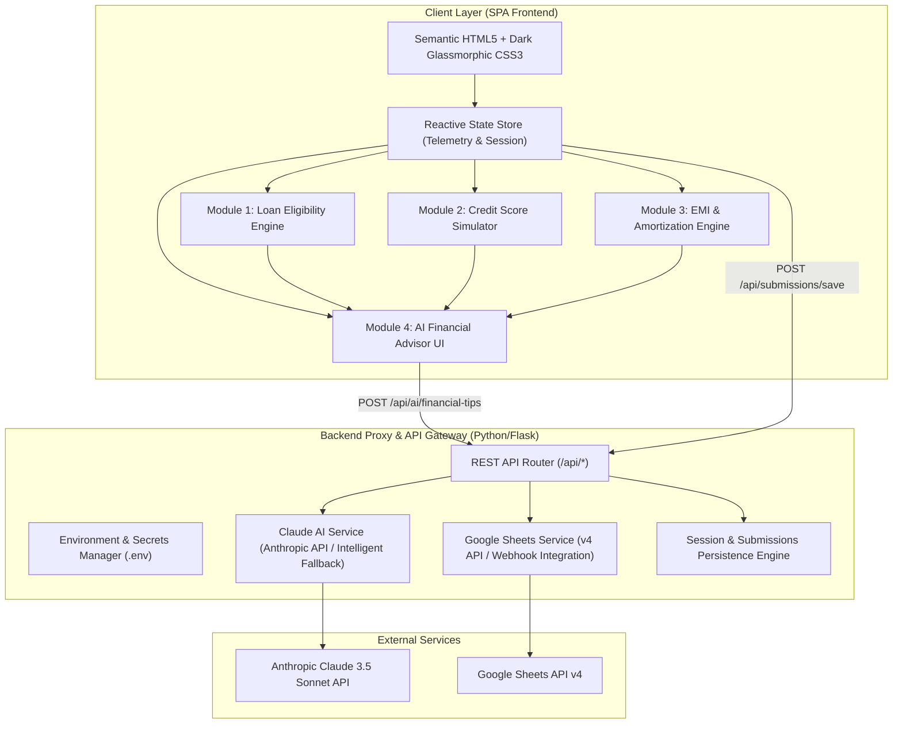

# Implementation Plan: AI Loan Eligibility Checker (BFSI Platform)

A full-featured, institutional-grade Banking, Financial Services & Insurance (BFSI) web application titled **"AI Loan Eligibility Checker"**.

## 1. Architectural Overview



## 2. Technology Stack & Design System

- **Frontend**:
  - Semantic HTML5 structure with high accessibility standards (WAI-ARIA, tab indices, keyboard navigability).
  - Modern CSS3: Deep midnight palette (`#080b14`, `#0d1322`), multi-layer `backdrop-filter: blur(16px)`, soft border illumination (`rgba(255,255,255,0.08)` / `rgba(0,242,254,0.2)`), neon cyan (`#00f2fe`), electric emerald (`#00e676`), warning amber (`#ffb300`), and royal violet (`#7928ca`) accents.
  - Native ES6+ JavaScript: Zero heavy framework dependencies, high-performance DOM manipulation, reactive state manager, custom SVG chart renderers.
- **Backend & Middleware**:
  - Python 3.14 + Flask REST server to securely proxy external APIs without exposing secrets to client-side code.
  - Anthropic Claude API integration with financial prompt engineering (delivering structured reasoning, DTI risk analysis, and actionable guidance).
  - Google Sheets API v4 integration supporting Service Account JSON credentials, API keys, or Apps Script webhooks, with local JSON persistence backup.
- **Testing & Validation**:
  - Automated Python unit tests (`test_app.py`) for financial mathematical models (EMI formula, DTI computation, credit simulation algorithms, and endpoint responses).

## 3. Core Functional Modules

### Module 1: Loan Eligibility Checker
- **Inputs**: Monthly gross income, existing monthly debt/EMIs, employment type (Salaried, Self-Employed, Freelancer, Business Owner), requested loan amount, loan purpose (Home, Personal, Auto, Business, Education), loan tenure.
- **Dynamic Metrics**:
  - Fixed Obligation to Income Ratio (FOIR / DTI) calculation.
  - Maximum allowable EMI threshold (50%–65% based on employment stability).
  - Max eligible loan amount derived from present value formula based on standard benchmark interest rates.
  - Multi-tier Eligibility Score (0–100) with visual status indicators: *Approved*, *Conditional Approval*, *Manual Review Required*, *High Risk*.

### Module 2: Credit Score Analyzer
- **Interactive Score Gauge**: Dynamic SVG circular gauge mapping scores 300 to 900 across standard credit bands (*Poor*, *Fair*, *Good*, *Very Good*, *Excellent*).
- **Impact Factors Breakdown**: Weighting cards for Payment History (35%), Utilization Ratio (30%), Credit History Length (15%), Credit Mix (10%), New Inquiries (10%).
- **Score Simulator**: Dynamic toggles and sliders to simulate real-time credit score adjustments:
  - Pay down credit balance by 25%–50%.
  - Erase missed payment penalty after consecutive on-time payments.
  - Reduce overall credit utilization below 30% or 10%.
  - Add new loan inquiry impact.

### Module 3: Interactive EMI Calculator
- **Inputs**: Interactive sliders and synchronized numeric inputs for:
  - Loan Principal ($5,000 to $2,000,000+).
  - Annual Interest Rate (3.5% to 24%).
  - Tenure (6 months to 30 years with Year/Month switcher).
- **Dynamic Visuals & Analytics**:
  - Exact monthly EMI calculation using standard annuity formula:
    $$EMI = P \times r \times \frac{(1+r)^n}{(1+r)^n - 1}$$
  - Dynamic SVG Donut Chart displaying Principal vs. Total Interest distribution.
  - Total Interest Payable and Total Outlay summary.
  - Amortization table: Annual breakdown and full monthly toggleable schedule showing Opening Balance, Principal Paid, Interest Paid, and Closing Balance.
  - Prepayment savings calculator simulator showing reduced tenure and interest savings.

### Module 4: AI Financial Tips (Claude AI Powered)
- **Live Context Aggregator**: Automatically aggregates telemetry across Eligibility, Credit, and EMI modules.
- **Claude AI Engine**:
  - Sends structured financial profile to Anthropic Claude 3.5 API.
  - Synthesizes bespoke advice: approval probability improvement, debt-to-income optimization, debt consolidation recommendations, and lender negotiation tips.
  - Built-in intelligent financial intelligence fallback when API key is pending configuration, ensuring zero downtime or broken UI.
  - Interactive "Ask Financial AI" inquiry box for custom user questions.

### Module 5: Database & Persistence (Google Sheets & Session Store)
- **Google Sheets API**: Direct sync of applicant profile, eligibility assessment, credit score simulation, and loan request metrics to a designated Google Sheet.
- **Local Fallback**: Transparent file-backed storage (`submissions.json`) and browser `localStorage` session caching so no user data is lost if network or Google credentials are offline.

## 4. Proposed File Structure

```
AI Loan Eligibility Checker/
├── app.py                      # Flask REST API & static server
├── requirements.txt            # Python dependencies
├── .env.example                # Template for Anthropic & Google Sheets credentials
├── .env                        # Local env variables
├── README.md                   # Comprehensive deployment and user guide
├── implementation_plan.md      # Project implementation roadmap
├── test_app.py                 # Automated unit tests for financial algorithms & APIs
├── services/
│   ├── __init__.py
│   ├── claude_service.py       # Anthropic Claude 3.5 API client & fallback logic
│   └── sheets_service.py       # Google Sheets API v4 integration & local persistence
└── static/
    ├── index.html              # Single-page application semantic markup
    ├── css/
    │   └── style.css           # Premium dark glassmorphism styling & animations
    └── js/
        ├── app.js              # Core SPA controller & tab router
        ├── eligibility.js      # Eligibility calculation engine & UI updates
        ├── credit.js           # Credit score analyzer, SVG meter & simulator
        ├── emi.js              # EMI slider controls, SVG donut chart & amortization
        ├── ai.js               # AI insights controller & Claude API streaming/querying
        └── sheets.js           # Google Sheets sync & submissions manager
```

## 5. Verification & Testing Strategy
1. **Mathematical Verification**:
   - Verify EMI formula against known banking benchmarks.
   - Verify DTI risk classification and maximum loan eligibility formulas across employment profiles.
   - Verify credit score simulation limits (bounded within 300 - 900).
2. **API & Service Testing**:
   - Test REST endpoints `/api/health`, `/api/calculate-eligibility`, `/api/ai/financial-tips`, `/api/submissions/save`, `/api/submissions/list`.
   - Test Claude AI integration with live API key and test fallback response synthesis when no key is present.
   - Test Google Sheets sync and graceful fallback to local storage.
3. **UI/UX & Responsiveness**:
   - Test interactive sliders, number inputs, tabs, mobile responsiveness, and dark glassmorphic styling across all 4 modules.
